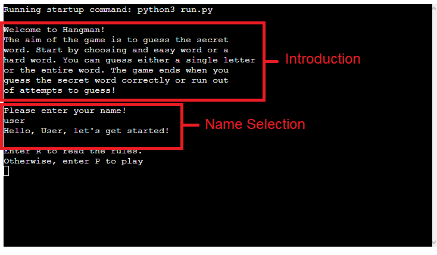
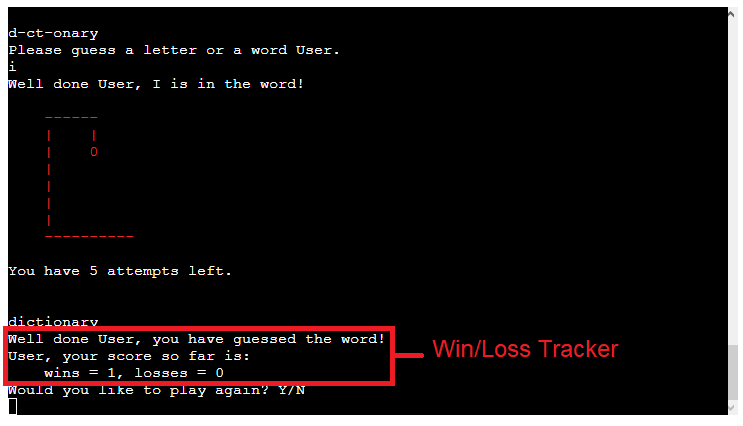

# Hang that man!
Hang that man! is an alternative of the classic word game 'Hangman'. It is built using Python and runs through the
Code institute mock terminal on Heroku.

# Contents

* [**User Experience**](<#user-experience>)
  * [Wireframes](<#wireframes>)
* [**Existing Features**](<#existing-features>)
  * [User Name Input](<#user-name-input>)
  * [Difficulty Selection](<#difficulty-selection>)
  * [Dynamic Attempts](<#dynamic-attempts>)
  * [Word Prompt](<#word-prompt>)
  * [Dynamic Hangman Image](#dynamic-hangman-image)
  * [Win/Loss Tracker](#winloss-tracker)
* [**Technologies Used**](#technologies-used)
* [**Testing and Quality Control**](#testing-and-quality-control)
  * [Device and Browser Testing](#device-and-browser-testing)
* [**Bugs**](#bugs)
* [**Deployment**](#deployemnt)
  * [Cloning a Project](#cloning-a-project)
* [**Credits**](#credits)
  * [Content](#content)
* [**Acknowledments**](#acknowledgements)

# User Experience
Users may attempt to guess the hidden word using either letter or word guesses. The game is over when the user guesses correctly
or runs out of attempts.

## Wireframes
Wireframes for Hang that man! were built using [Balsamiq](https:/balsamiq.com).

The first wireframe consists of the initial game flow. The user is prompeted to input a name and select a difficulty. After this, the hidden answer is calculated and the number of attempts the user is given is dynamically calculated. A prompt is then built to store and display the user's correct guesses. Once the starting prompt is created, the main gameplay loop runs until the user either wins or loses. The user is then prompted to play again, returning them back to the start of the game flow.

The second wireframe consists of the primary gameplay loop. The user is prompted to input either a letter or word guess into the console. 
If the user inputs a word it is checked if it matches the hidden word. When the user guesses correctly, the prompt is filled in and the user wins the loop. When the user guesses incorrectly, the number of attempts is decreased by one.
If the user inputs a letter the program checks if the letter is within the hidden word. If the guess is correct, the prompt is updated with the correct guess in the correct place(s). If the guess is incorrect, the number of attempts is decreased by one.
The main gameplay loop ends when the user either correctly guesses the word, using either letters or word guesses, or runs out of attempts.

[Back to top](<#contents>)

# Existing Features

## User Name Input
The user is prompted, during the initial loop of the game, to input a name. The name is checked to ensure it is containing only letters and does not contain symbols or numbers. If the user inputs an invalid name, the program prompts them to enter a new name and explains the valid input for a name. If the user inputs a valid name, the input is stored as the user_name variable.
The user_name variable is used to add a personal touch to the game experience for the user.

## Difficulty Selection
The user is prompted to choose a difficulty, with either easy or hard as options. When the user selects a difficulty, the program selects a random word from the appropriate list and stores it as the word_to_guess variable. If the user inputs an invalid option, an error message is generated and the user is prompted again.

## Dynamic Attempts
Once the user selects a difficulty, the program the sets the number of attempts the user gets for guessing the answers. A value equal to one quater of the hidden word is added to the base attempt of six. This attempt calculation guarentees a minimum amount of attempts for the hangman images to work with, while also maintaining dynamic difficulty. The attempts are displayed to the user throughout the game so they do not need to scroll in order to see their remaining attempts.

## Word Prompt
The word to guess that the difficulty selector created is used to build a prompt to help the user guess. The prompt builder creates a series of underscore lines ("_") equal to the length of the word to guess

## Dynamic Hangman Image
The hangman image uses the dynamic attempts calculation to display the hangman image according to the number of attempts the user has left. For the final six attempts, the images of the hangman stages cycle through as the user runs out of attempts. Prior to this, text is displayed providing context for the user.

## Win/Loss tracker
The user is provided with a running tally of their wins and losses during the running of the program. So long as the user chooses to continue playing, the tally will keep track of their progress and inform them at the end of each game.

[Back to top](<#contents>)

# Technologies Used

* [Python](https://www.python.org) - Sole programming language used to program the game.
* [Heroku](https://www.heroku.com) - Hosting platform for the programme.
* [Balsamiq](https://balsamiq.com/wireframes/) - Design and build wireframes for the site.
* [Github](https://github.com) - Acts as a repository for the site's code.
* [Gitpod](https://www.gitpod.io) - Builds and edits the code for the site.

[Back to top](<#contents>)

# Testing and Quality Control

Hang that man! was tested in both Gitpod during development and on the Heroku Terminal following deployemnt.
Expected results from user inputs were checked and corrected when errors occured as follows:
* Name input function stored user's entry as desired and printed error message when user input was not alphabetic.
* Difficulty selector pulled the guess word from the correct list when user selected a difficulty.
* Input error for the difficulty selector correctly prompts the user with the proper error message.
* The dynamic hangman image responds correctly to the number of attempts left for the user.
* The user's input is correctly stored and checked for repeats. Repeats are flagged to the user.
* Both letter and word input word as expected.
* USer wins and losses are stored and presented correctly to the user.

All python files pass through validation using the [Pep8](http://pep8online.com) online software. All files pass through with no errors present.

The example for the run.py result are below:

[Back to top](<#contents>)

## Device and Browser Testing

Hang that man! was tested on the Opera, Google Chrome, Safari, and Microsoft edge browsers. Heroku correctly displayed and ran the program on all browsers.

The game successfully ran through Heroku without errors occuring on the following devices:
* Windows Desktop
* iPad mini 3
* Moto g50
* iPhone 4s

User testing took place via friends and family to identify bugs and issues with user experience.

[Back to top](<#contents>)

# Bugs

During development the following bugs were identified and corrected:
* Name input would store an invalid entry to the name variable on user input and would not be replaced by the repeat entry. Moving the return function corrected the error.
* Difficulty selection would store an invalid entry and would not be replaced by the repeat entry. Moving the return function corrected the error.
* Console size was too wide during development. Adjusted code to fit within parameters.
* User score function would reset for each run of main loop. Changed score storage to list fixed issue.

[Back to top](<#contents>)

# Deployemnt

The game was deployed via an online terminal developed by Code institute known as Heroku, developed to facilitate deployment and host applications created using backend languages such Python. The deployment process is as follows:

1. Create new Heroku app from Heroku dashboard
2. Name the app with a name that is available.
3. Choose the region from which you are from (Europe)
4. Select the create app button
5. Select 'Settings' from the main menu
6. Scroll to 'Config Vars' section and select 'Reveal Config Vars'
7. In the 'Key' field input 'PORT' in the 'Value' field input '8000'
8. Press 'Add' to add the value just entered
9. Scroll down to 'Add buildpack' and select it
10. Select 'Python' and save changes
11. Select 'Add buildpack' again and do the same with 'NodeJs'
12. Link the App to your repository
13. Select deploy

[Back to top](<#contents>)

## Cloning a project

1. Go to https://github.com/
2. Log into account
3. Click on the repository to be cloned
4. Click the drop-down list arrow on the "Code" tab
5. Click on the copy link icon next to the url of the repository
6. Create a new repository and launch Gitpod to create a workspace from it
7. In the gitpod terminal type: "git clone"
8. Paste the copied link and press enter

[Back to top](<#contents>)

# Credits

## Content
* The initial project structure was inspired by Debiani Paul's article from [iCodemag](https://icodemag.com/creating-a-simple-hangman-game-in-python/).
* The base python code was sourced from Kite on [Youtube](https://www.youtube.com/watch?v=m4nEnsavl6w).
* The Readme format was sourced from Lavlen on [Github](https://github.com/Lavlen/hangman/blob/main/README.md).
* The easy word list was sourced from [Oxford Owl](https://cdn.oxfordowl.co.uk/2019/08/29/13/56/09/5a42eb6a-f57f-4dc4-a66e-bd4c5e27e4b7/SpellingWordList_Y5-6.pdf).
* The hard word list was sourced from [Hangman Words](https://www.hangmanwords.com/words).

[Back to top](<#contents>)

# Acknowledgements
The site was completed as Portfolio Project 3 for the Diploma in Software Development (E-commerce Applications) with the Code Institute. I would like to thank my mentor Precious Ijege, the Slack community, and all at the Code Institute for their help and support. Thank you to my friends and family who helped me test the site.

Miles Cownie 2022.

[Back to top](<#contents>)